# Fluxos dos comandos

Um fluxograma por comando de `kioskd` (serviço e administração local) e `kioskctl` (CLI dos pais). Cada um mostra quem age, que dado passa de uma etapa para a próxima, onde a informação é gravada e o que volta para quem chamou. Regra do projeto: ver [AGENTS.md](../../AGENTS.md#fluxogramas-dos-comandos). O teste `tests/documentacao.rs` reprova o build se algum comando ficar sem fluxograma aqui.

Decisões de origem: [arquitetura](README.md) (Camadas 0 a 5), [ADR-002](../adr/ADR-002-identidade-por-conta-windows.md) (perfil por SID), [ADR-003](../adr/ADR-003-deteccao-de-processos-e-tempo-de-uso.md) (detecção e tempo de uso), [ADR-005](../adr/ADR-005-rede-da-api-de-comando.md) (rede) e [ADR-006](../adr/ADR-006-assinatura-de-requisicoes-e-pareamento.md) (assinatura e pareamento). Uso no dia a dia: [runbook](../runbooks/api-e-cli.md).

## Visão geral

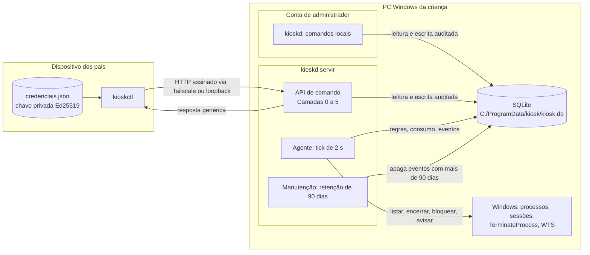
```mermaid
flowchart LR
    subgraph PAIS["Dispositivo dos pais"]
        CTL["kioskctl"]
        CRED[("credenciais.json<br/>chave privada Ed25519")]
    end
    subgraph PC["PC Windows da criança"]
        subgraph ADM["Conta de administrador"]
            KD["kioskd: comandos locais"]
        end
        subgraph SRV["kioskd servir"]
            API["API de comando<br/>Camadas 0 a 5"]
            AG["Agente: tick de 2 s"]
            MAN["Manutenção: retenção de 90 dias"]
        end
        DB[("SQLite<br/>C:/ProgramData/kiosk/kiosk.db")]
        WIN["Windows: processos, sessões,<br/>TerminateProcess, WTS"]
    end
    CRED --> CTL
    CTL -->|"HTTP assinado via Tailscale ou loopback"| API
    API -->|"resposta genérica"| CTL
    KD -->|"leitura e escrita auditada"| DB
    API -->|"leitura e escrita auditada"| DB
    AG -->|"regras, consumo, eventos"| DB
    AG -->|"listar, encerrar, bloquear, avisar"| WIN
    MAN -->|"apaga eventos com mais de 90 dias"| DB
```

## Pipeline comum das requisições assinadas

Todos os comandos remotos do `kioskctl` (exceto `parear`) passam por estas etapas no serviço. Nos diagramas de cada comando ele aparece resumido como "Camadas 0 a 3".

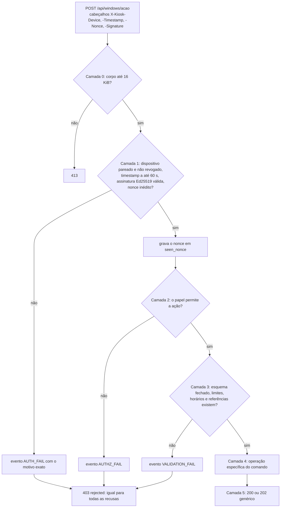
```mermaid
flowchart TD
    REQ["POST /api/windows/acao<br/>cabeçalhos X-Kiosk-Device, -Timestamp, -Nonce, -Signature"] --> C0
    C0{"Camada 0: corpo até 16 KiB?"} -->|não| R413["413"]
    C0 -->|sim| C1{"Camada 1: dispositivo pareado e não revogado,<br/>timestamp a até 60 s, assinatura Ed25519 válida,<br/>nonce inédito?"}
    C1 -->|não| AF["evento AUTH_FAIL com o motivo exato"]
    C1 -->|sim| N["grava o nonce em seen_nonce"] --> C2{"Camada 2: o papel permite a ação?"}
    C2 -->|não| AZ["evento AUTHZ_FAIL"]
    C2 -->|sim| C3{"Camada 3: esquema fechado, limites,<br/>horários e referências existem?"}
    C3 -->|não| VF["evento VALIDATION_FAIL"]
    C3 -->|sim| C4["Camada 4: operação específica do comando"]
    AF --> R403["403 rejected: igual para todas as recusas"]
    AZ --> R403
    VF --> R403
    C4 --> C5["Camada 5: 200 ou 202 genérico"]
```

## kioskd

### `kioskd servir`

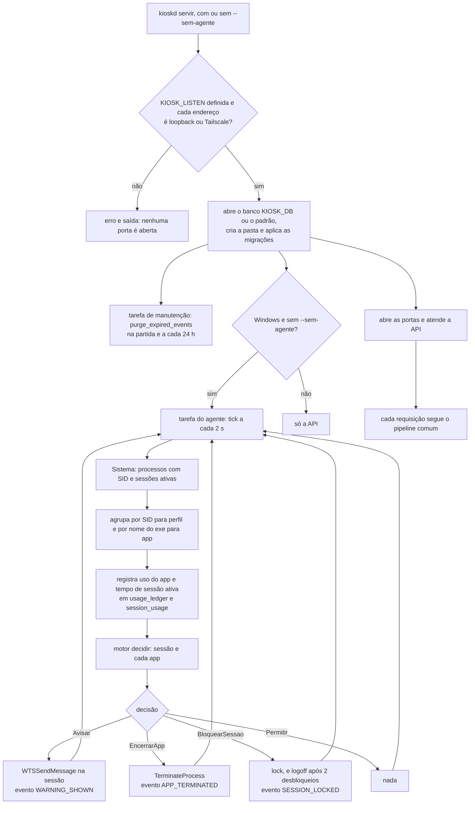
```mermaid
flowchart TD
    A["kioskd servir, com ou sem --sem-agente"] --> B{"KIOSK_LISTEN definida e cada endereço<br/>é loopback ou Tailscale?"}
    B -->|não| E1["erro e saída: nenhuma porta é aberta"]
    B -->|sim| C["abre o banco KIOSK_DB ou o padrão,<br/>cria a pasta e aplica as migrações"]
    C --> D["tarefa de manutenção: purge_expired_events<br/>na partida e a cada 24 h"]
    C --> F{"Windows e sem --sem-agente?"}
    F -->|sim| G["tarefa do agente: tick a cada 2 s"]
    F -->|não| H["só a API"]
    C --> I["abre as portas e atende a API"]
    G --> T1["Sistema: processos com SID e sessões ativas"]
    T1 --> T2["agrupa por SID para perfil e por nome do exe para app"]
    T2 --> T3["registra uso do app e tempo de sessão ativa<br/>em usage_ledger e session_usage"]
    T3 --> T4["motor decidir: sessão e cada app"]
    T4 --> T5{"decisão"}
    T5 -->|Avisar| T6["WTSSendMessage na sessão<br/>evento WARNING_SHOWN"]
    T5 -->|EncerrarApp| T7["TerminateProcess<br/>evento APP_TERMINATED"]
    T5 -->|BloquearSessao| T8["lock, e logoff após 2 desbloqueios<br/>evento SESSION_LOCKED"]
    T5 -->|Permitir| T9["nada"]
    T6 --> G
    T7 --> G
    T8 --> G
    T9 --> G
    I --> P["cada requisição segue o pipeline comum"]
```

### `kioskd codigo-pareamento`

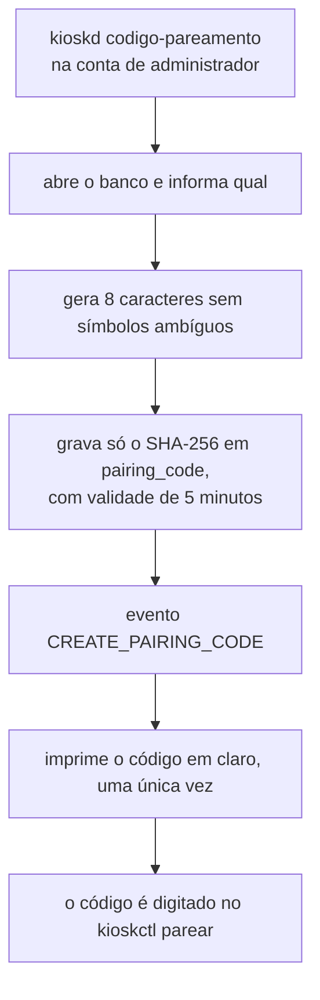
```mermaid
flowchart TD
    A["kioskd codigo-pareamento<br/>na conta de administrador"] --> B["abre o banco e informa qual"]
    B --> C["gera 8 caracteres sem símbolos ambíguos"]
    C --> D["grava só o SHA-256 em pairing_code,<br/>com validade de 5 minutos"]
    D --> E["evento CREATE_PAIRING_CODE"]
    E --> F["imprime o código em claro, uma única vez"]
    F --> G["o código é digitado no kioskctl parear"]
```

### `kioskd dispositivos`

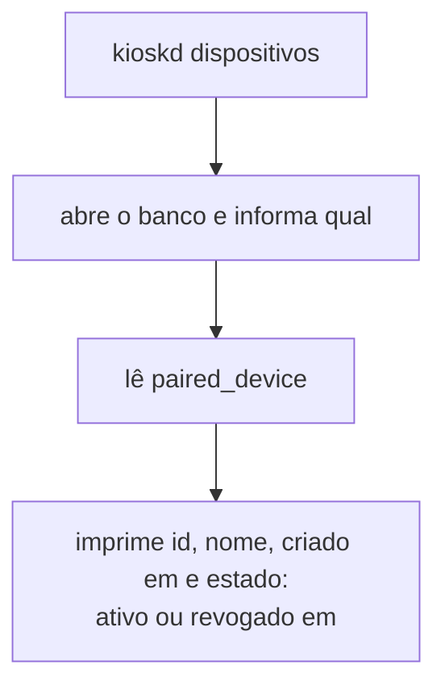
```mermaid
flowchart TD
    A["kioskd dispositivos"] --> B["abre o banco e informa qual"]
    B --> C["lê paired_device"]
    C --> D["imprime id, nome, criado em e estado:<br/>ativo ou revogado em"]
```

### `kioskd revogar`

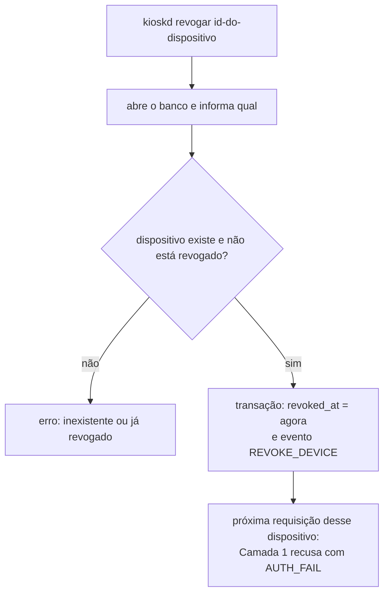
```mermaid
flowchart TD
    A["kioskd revogar id-do-dispositivo"] --> B["abre o banco e informa qual"]
    B --> C{"dispositivo existe e não está revogado?"}
    C -->|não| E["erro: inexistente ou já revogado"]
    C -->|sim| D["transação: revoked_at = agora<br/>e evento REVOKE_DEVICE"]
    D --> F["próxima requisição desse dispositivo:<br/>Camada 1 recusa com AUTH_FAIL"]
```

### `kioskd perfil criar`

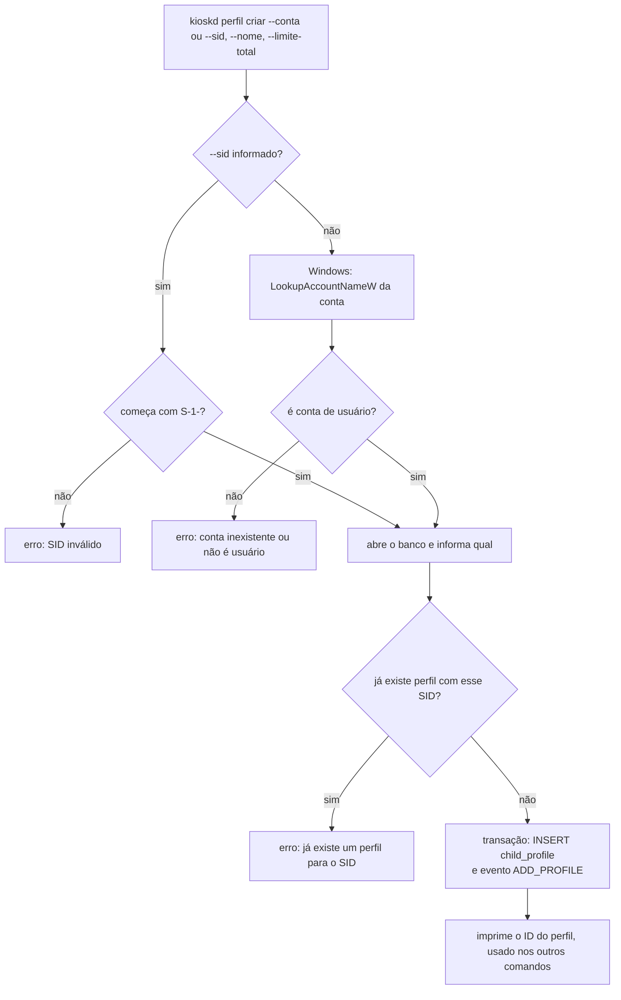
```mermaid
flowchart TD
    A["kioskd perfil criar --conta ou --sid, --nome, --limite-total"] --> B{"--sid informado?"}
    B -->|sim| C{"começa com S-1-?"}
    C -->|não| E1["erro: SID inválido"]
    B -->|não| D["Windows: LookupAccountNameW da conta"]
    D --> D2{"é conta de usuário?"}
    D2 -->|não| E2["erro: conta inexistente ou não é usuário"]
    C -->|sim| F["abre o banco e informa qual"]
    D2 -->|sim| F
    F --> G{"já existe perfil com esse SID?"}
    G -->|sim| E3["erro: já existe um perfil para o SID"]
    G -->|não| H["transação: INSERT child_profile<br/>e evento ADD_PROFILE"]
    H --> I["imprime o ID do perfil, usado nos outros comandos"]
```

### `kioskd perfil listar`

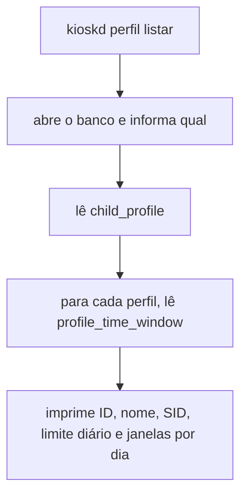
```mermaid
flowchart TD
    A["kioskd perfil listar"] --> B["abre o banco e informa qual"]
    B --> C["lê child_profile"]
    C --> D["para cada perfil, lê profile_time_window"]
    D --> E["imprime ID, nome, SID, limite diário e janelas por dia"]
```

### `kioskd perfil limite`

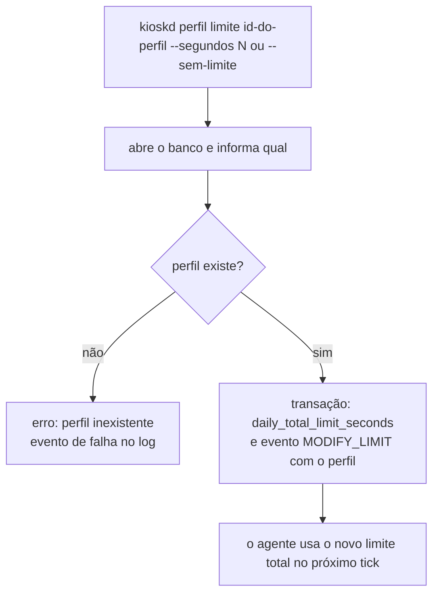
```mermaid
flowchart TD
    A["kioskd perfil limite id-do-perfil --segundos N ou --sem-limite"] --> B["abre o banco e informa qual"]
    B --> C{"perfil existe?"}
    C -->|não| E["erro: perfil inexistente<br/>evento de falha no log"]
    C -->|sim| D["transação: daily_total_limit_seconds<br/>e evento MODIFY_LIMIT com o perfil"]
    D --> F["o agente usa o novo limite total no próximo tick"]
```

### `kioskd perfil janela`

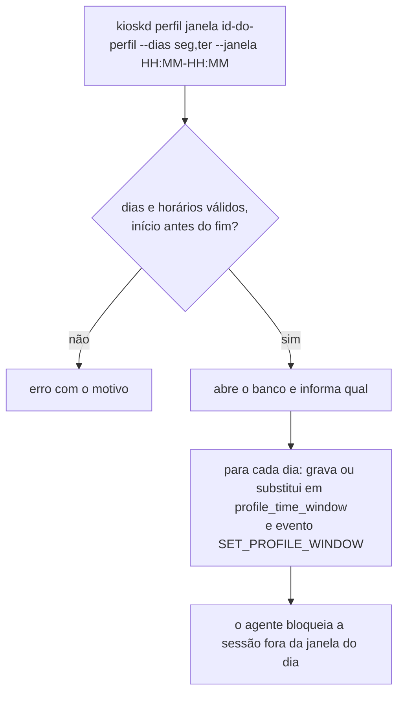
```mermaid
flowchart TD
    A["kioskd perfil janela id-do-perfil --dias seg,ter --janela HH:MM-HH:MM"] --> B{"dias e horários válidos,<br/>início antes do fim?"}
    B -->|não| E1["erro com o motivo"]
    B -->|sim| C["abre o banco e informa qual"]
    C --> D["para cada dia: grava ou substitui em profile_time_window<br/>e evento SET_PROFILE_WINDOW"]
    D --> F["o agente bloqueia a sessão fora da janela do dia"]
```

### `kioskd app criar`

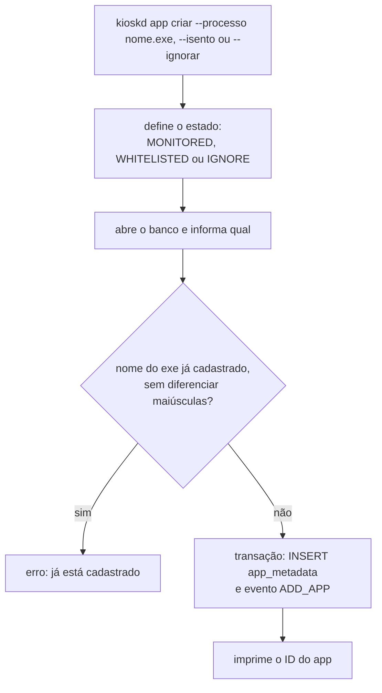
```mermaid
flowchart TD
    A["kioskd app criar --processo nome.exe, --isento ou --ignorar"] --> B["define o estado:<br/>MONITORED, WHITELISTED ou IGNORE"]
    B --> C["abre o banco e informa qual"]
    C --> D{"nome do exe já cadastrado,<br/>sem diferenciar maiúsculas?"}
    D -->|sim| E["erro: já está cadastrado"]
    D -->|não| F["transação: INSERT app_metadata<br/>e evento ADD_APP"]
    F --> G["imprime o ID do app"]
```

### `kioskd app listar`

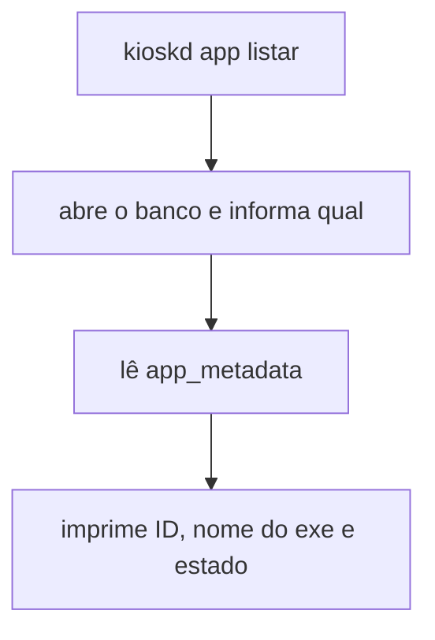
```mermaid
flowchart TD
    A["kioskd app listar"] --> B["abre o banco e informa qual"]
    B --> C["lê app_metadata"]
    C --> D["imprime ID, nome do exe e estado"]
```

### `kioskd regra criar`

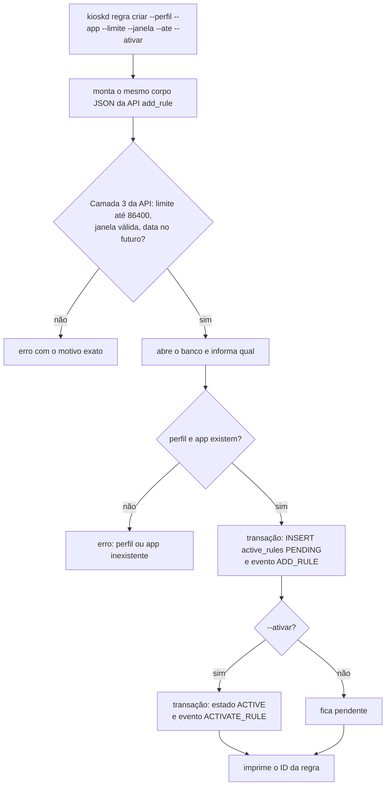
```mermaid
flowchart TD
    A["kioskd regra criar --perfil --app --limite --janela --ate --ativar"] --> B["monta o mesmo corpo JSON da API add_rule"]
    B --> C{"Camada 3 da API: limite até 86400,<br/>janela válida, data no futuro?"}
    C -->|não| E1["erro com o motivo exato"]
    C -->|sim| D["abre o banco e informa qual"]
    D --> F{"perfil e app existem?"}
    F -->|não| E2["erro: perfil ou app inexistente"]
    F -->|sim| G["transação: INSERT active_rules PENDING<br/>e evento ADD_RULE"]
    G --> H{"--ativar?"}
    H -->|sim| I["transação: estado ACTIVE<br/>e evento ACTIVATE_RULE"]
    H -->|não| J["fica pendente"]
    I --> K["imprime o ID da regra"]
    J --> K
```

### `kioskd regra ativar`

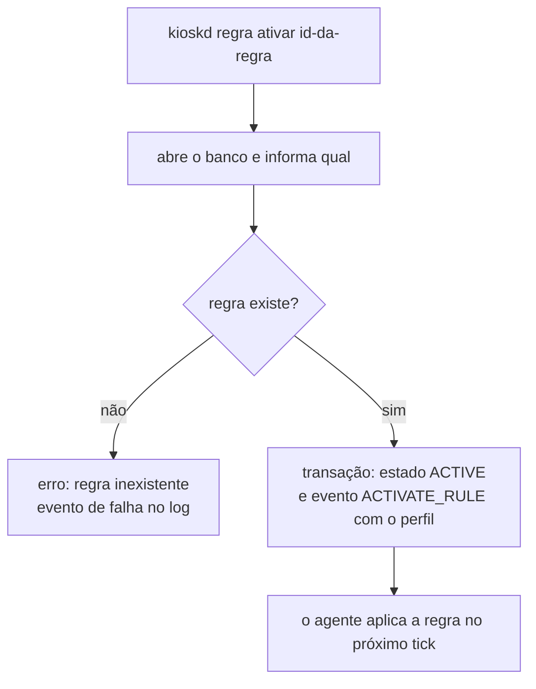
```mermaid
flowchart TD
    A["kioskd regra ativar id-da-regra"] --> B["abre o banco e informa qual"]
    B --> C{"regra existe?"}
    C -->|não| E["erro: regra inexistente<br/>evento de falha no log"]
    C -->|sim| D["transação: estado ACTIVE<br/>e evento ACTIVATE_RULE com o perfil"]
    D --> F["o agente aplica a regra no próximo tick"]
```

### `kioskd regra revogar`

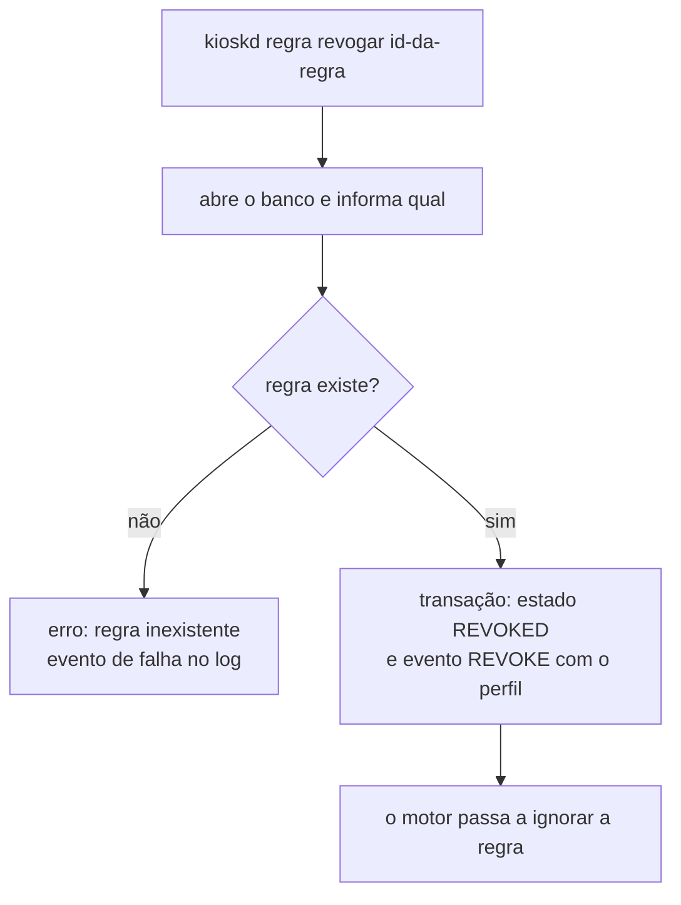
```mermaid
flowchart TD
    A["kioskd regra revogar id-da-regra"] --> B["abre o banco e informa qual"]
    B --> C{"regra existe?"}
    C -->|não| E["erro: regra inexistente<br/>evento de falha no log"]
    C -->|sim| D["transação: estado REVOKED<br/>e evento REVOKE com o perfil"]
    D --> F["o motor passa a ignorar a regra"]
```

### `kioskd regra limite`

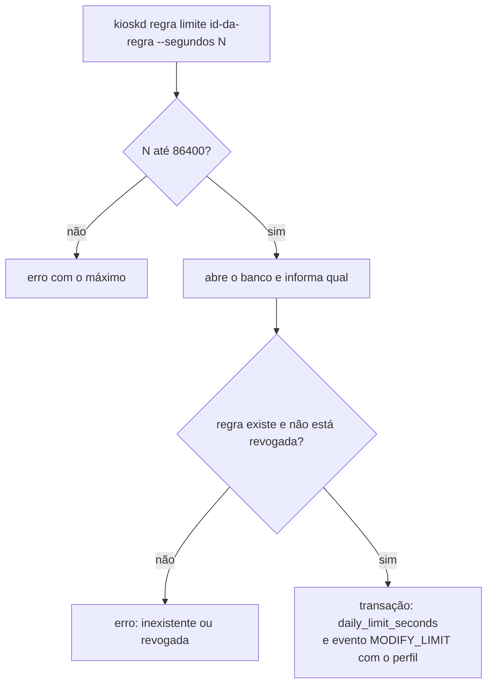
```mermaid
flowchart TD
    A["kioskd regra limite id-da-regra --segundos N"] --> B{"N até 86400?"}
    B -->|não| E1["erro com o máximo"]
    B -->|sim| C["abre o banco e informa qual"]
    C --> D{"regra existe e não está revogada?"}
    D -->|não| E2["erro: inexistente ou revogada"]
    D -->|sim| F["transação: daily_limit_seconds<br/>e evento MODIFY_LIMIT com o perfil"]
```

### `kioskd regra listar`

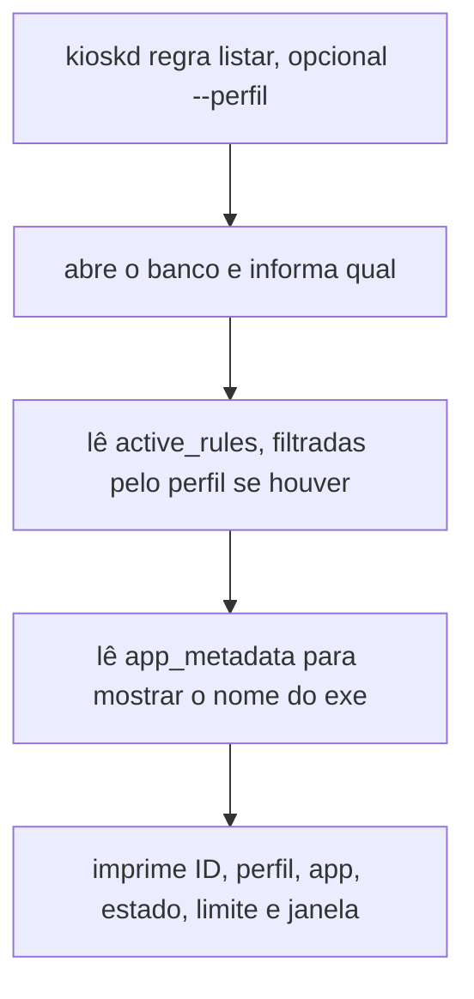
```mermaid
flowchart TD
    A["kioskd regra listar, opcional --perfil"] --> B["abre o banco e informa qual"]
    B --> C["lê active_rules, filtradas pelo perfil se houver"]
    C --> D["lê app_metadata para mostrar o nome do exe"]
    D --> E["imprime ID, perfil, app, estado, limite e janela"]
```

### `kioskd instalar`

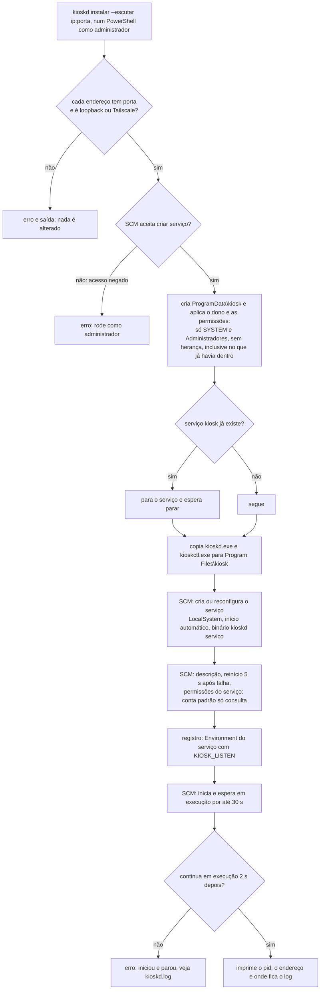
```mermaid
flowchart TD
    A["kioskd instalar --escutar ip:porta, num PowerShell como administrador"] --> B{"cada endereço tem porta<br/>e é loopback ou Tailscale?"}
    B -->|não| E1["erro e saída: nada é alterado"]
    B -->|sim| C{"SCM aceita criar serviço?"}
    C -->|"não: acesso negado"| E2["erro: rode como administrador"]
    C -->|sim| D["cria ProgramData\kiosk e aplica o dono e as permissões:<br/>só SYSTEM e Administradores, sem herança, inclusive no que já havia dentro"]
    D --> F{"serviço kiosk já existe?"}
    F -->|sim| G["para o serviço e espera parar"]
    F -->|não| H["segue"]
    G --> I["copia kioskd.exe e kioskctl.exe para Program Files\kiosk"]
    H --> I
    I --> J["SCM: cria ou reconfigura o serviço<br/>LocalSystem, início automático, binário kioskd servico"]
    J --> K["SCM: descrição, reinício 5 s após falha,<br/>permissões do serviço: conta padrão só consulta"]
    K --> L["registro: Environment do serviço com KIOSK_LISTEN"]
    L --> M["SCM: inicia e espera em execução por até 30 s"]
    M --> N{"continua em execução 2 s depois?"}
    N -->|não| E3["erro: iniciou e parou, veja kioskd.log"]
    N -->|sim| R["imprime o pid, o endereço e onde fica o log"]
```

O banco não é tocado pela instalação; o serviço o abre e aplica as migrações ao subir. Nada vai para o log forense: a instalação é ato do administrador do PC.

### `kioskd desinstalar`

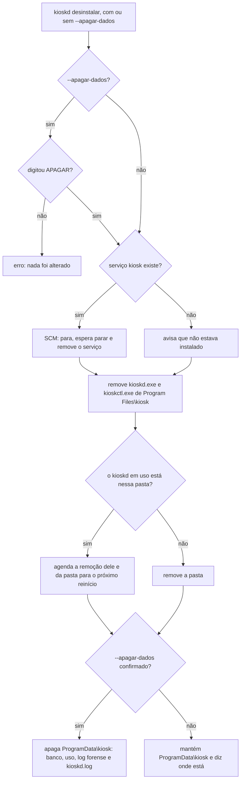
```mermaid
flowchart TD
    A["kioskd desinstalar, com ou sem --apagar-dados"] --> B{"--apagar-dados?"}
    B -->|sim| C{"digitou APAGAR?"}
    C -->|não| E1["erro: nada foi alterado"]
    C -->|sim| D
    B -->|não| D{"serviço kiosk existe?"}
    D -->|sim| F["SCM: para, espera parar e remove o serviço"]
    D -->|não| G["avisa que não estava instalado"]
    F --> H["remove kioskd.exe e kioskctl.exe de Program Files\kiosk"]
    G --> H
    H --> I{"o kioskd em uso está nessa pasta?"}
    I -->|sim| J["agenda a remoção dele e da pasta para o próximo reinício"]
    I -->|não| K["remove a pasta"]
    J --> L{"--apagar-dados confirmado?"}
    K --> L
    L -->|sim| M["apaga ProgramData\kiosk: banco, uso, log forense e kioskd.log"]
    L -->|não| N["mantém ProgramData\kiosk e diz onde está"]
```

### `kioskd estado`

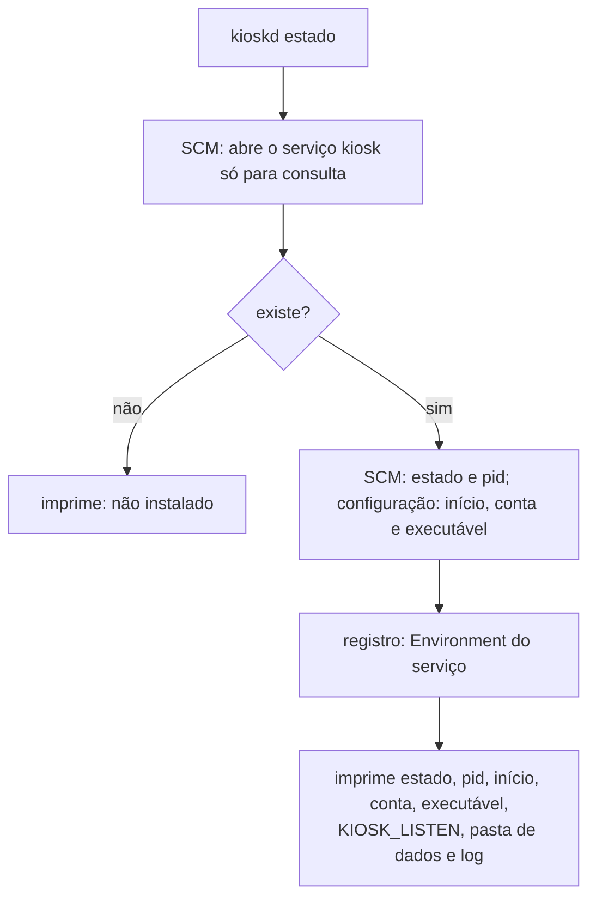
```mermaid
flowchart TD
    A["kioskd estado"] --> B["SCM: abre o serviço kiosk só para consulta"]
    B --> C{"existe?"}
    C -->|não| R1["imprime: não instalado"]
    C -->|sim| D["SCM: estado e pid; configuração: início, conta e executável"]
    D --> E["registro: Environment do serviço"]
    E --> R2["imprime estado, pid, início, conta, executável,<br/>KIOSK_LISTEN, pasta de dados e log"]
```

Só lê; não abre o banco nem grava evento.

### `kioskd servico`

```mermaid
flowchart TD
    W["Windows: SCM inicia Program Files\kiosk\kioskd.exe servico,<br/>como LocalSystem, com KIOSK_LISTEN do registro"] --> A["entrega a thread principal ao SCM"]
    A --> B["registra o tratador de controle; informa iniciando"]
    B --> C{"abre ProgramData\kiosk\kioskd.log?"}
    C -->|não| E1["informa parado com código 3"]
    C -->|sim| D["stderr vai para o log; gira para .1 acima de 10 MiB"]
    D --> F["informa em execução"]
    F --> G["mesmo fluxo do kioskd servir com o agente"]
    G --> H{"o que acontece primeiro?"}
    H -->|"SCM pede parar ou desligamento"| I["informa parando; encerra as tarefas em até 5 s"]
    H -->|"servir falha, por exemplo porta ocupada"| J["registra o erro no log"]
    I --> K["informa parado, código 0"]
    J --> L["informa parado com código 1"]
    L --> M["SCM reinicia o serviço após 5 s"]
    E1 --> M
```

Rodado à mão, fora do SCM, falha e explica que o caminho é `kioskd instalar`.

## kioskctl

### `kioskctl parear`

```mermaid
flowchart TD
    subgraph PAIS["Dispositivo dos pais"]
        A["kioskctl parear --servidor --codigo --nome"] --> B{"credenciais.json já existe?"}
        B -->|sim| E1["erro: apague o arquivo para parear de novo"]
        B -->|não| C["gera o par de chaves Ed25519"]
        C --> D["corpo: código, chave pública em base64 e nome"]
    end
    D -->|"POST /api/pair, sem assinatura: o código é a credencial"| F
    subgraph SRV["kioskd servir"]
        F{"10 falhas de pareamento em 5 minutos?"} -->|sim| R1["evento AUTH_FAIL: pareamento bloqueado"]
        F -->|não| G{"chave pública válida e nome preenchido?"}
        G -->|não| R2["evento VALIDATION_FAIL"]
        G -->|sim| H{"hash do código existe, não usado e não expirado?"}
        H -->|não| R3["evento AUTH_FAIL"]
        H -->|sim| I["transação: marca o código como usado,<br/>INSERT paired_device e evento PAIR_DEVICE"]
    end
    R1 --> X["403 rejected"]
    R2 --> X
    R3 --> X
    I --> Y["202 com o device_id"]
    X --> Z1["kioskctl: recusa e como gerar outro código"]
    Y --> Z2["grava credenciais.json:<br/>servidor, device_id e chave privada, permissão 0600 no Unix"]
```

### `kioskctl regra criar`

```mermaid
flowchart TD
    subgraph PAIS["Dispositivo dos pais"]
        A["kioskctl regra criar --perfil --app --limite --janela --ate"] --> B["monta o corpo JSON add_rule"]
        B --> C["lê credenciais.json e assina a requisição"]
    end
    C -->|"POST /api/windows/add_rule"| D
    subgraph SRV["kioskd servir"]
        D["Camadas 0 a 3: pipeline comum,<br/>perfil e app precisam existir"] --> E["Camada 4: transação INSERT active_rules PENDING<br/>e evento ADD_RULE com o IP da conexão"]
    end
    D -->|recusa| R1["403 rejected"]
    E --> R2["202 accepted com o id da regra"]
    R1 --> F1["kioskctl: o serviço recusou; motivo no log do PC"]
    R2 --> F2["kioskctl imprime: regra criada pendente"]
```

### `kioskctl regra ativar`

```mermaid
flowchart TD
    subgraph PAIS["Dispositivo dos pais"]
        A["kioskctl regra ativar id-da-regra"] --> B["corpo JSON rule_id, assinado"]
    end
    B -->|"POST /api/windows/activate_rule"| C
    subgraph SRV["kioskd servir"]
        C["Camadas 0 a 3: a regra precisa existir"] --> D["Camada 4: estado ACTIVE<br/>e evento ACTIVATE_RULE"]
        D --> AG["o agente aplica no próximo tick"]
    end
    C -->|recusa| R1["403 rejected"]
    D --> R2["202 accepted"]
    R1 --> F1["kioskctl: recusou"]
    R2 --> F2["kioskctl: regra ativada"]
```

### `kioskctl regra revogar`

```mermaid
flowchart TD
    subgraph PAIS["Dispositivo dos pais"]
        A["kioskctl regra revogar id-da-regra"] --> B["corpo JSON rule_id, assinado"]
    end
    B -->|"POST /api/windows/revoke_rule"| C
    subgraph SRV["kioskd servir"]
        C["Camadas 0 a 3: a regra precisa existir"] --> D["Camada 4: estado REVOKED<br/>e evento REVOKE"]
        D --> AG["o motor passa a ignorar a regra"]
    end
    C -->|recusa| R1["403 rejected"]
    D --> R2["202 accepted"]
    R1 --> F1["kioskctl: recusou"]
    R2 --> F2["kioskctl: regra revogada"]
```

### `kioskctl regra limite`

```mermaid
flowchart TD
    subgraph PAIS["Dispositivo dos pais"]
        A["kioskctl regra limite id-da-regra --segundos N"] --> B["corpo JSON rule_id e daily_limit_seconds, assinado"]
    end
    B -->|"POST /api/windows/modify_limit"| C
    subgraph SRV["kioskd servir"]
        C["Camadas 0 a 3: N até 86400, a regra precisa existir"] --> D{"regra revogada?"}
        D -->|sim| X["falha registrada no log"]
        D -->|não| E["Camada 4: daily_limit_seconds<br/>e evento MODIFY_LIMIT com o perfil"]
    end
    C -->|recusa| R1["403 rejected"]
    X --> R1
    E --> R2["202 accepted"]
    R1 --> F1["kioskctl: recusou"]
    R2 --> F2["kioskctl: novo limite diário"]
```

### `kioskctl uso`

```mermaid
flowchart TD
    subgraph PAIS["Dispositivo dos pais"]
        A["kioskctl uso --perfil, --data opcional"] --> B["data padrão: hoje no fuso local"]
        B --> C["corpo JSON profile_id e date, assinado"]
    end
    C -->|"POST /api/windows/usage"| D
    subgraph SRV["kioskd servir"]
        D["Camadas 0 a 3: data AAAA-MM-DD, o perfil precisa existir"] --> E["lê session_usage: tempo de sessão ativa"]
        E --> F["lê usage_ledger com app_metadata: tempo por app"]
        F --> G["consulta: não grava evento"]
    end
    D -->|recusa| R1["403 rejected"]
    G --> R2["200 com session_seconds e apps"]
    R1 --> H1["kioskctl: recusou"]
    R2 --> H2["kioskctl imprime as durações, por exemplo 1h 05min 30s"]
```

### `kioskctl log`

```mermaid
flowchart TD
    subgraph PAIS["Dispositivo dos pais"]
        A["kioskctl log --perfil, --dias, --limite"] --> B["período: agora menos N dias até agora"]
        B --> C["corpo JSON from, to, profile_id e limit, assinado"]
    end
    C -->|"POST /api/windows/log"| D
    subgraph SRV["kioskd servir"]
        D["Camadas 0 a 3: período até 31 dias, limite de 1 a 500,<br/>o perfil precisa existir"] --> E["lê security_log em ordem cronológica"]
        E --> F{"tipo do evento é AUTH_FAIL, AUTHZ_FAIL,<br/>VALIDATION_FAIL ou INTERNAL_ERROR?"}
        F -->|sim| G["detalhe omitido: fica só no banco do PC"]
        F -->|não| H["detalhe incluído"]
        G --> I["consulta: não grava evento"]
        H --> I
    end
    D -->|recusa| R1["403 rejected"]
    I --> R2["200 com a lista de eventos"]
    R1 --> J1["kioskctl: recusou"]
    R2 --> J2["kioskctl imprime: horário, tipo, ação e detalhe"]
```
